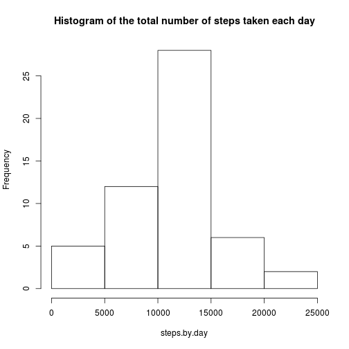
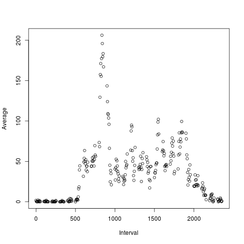
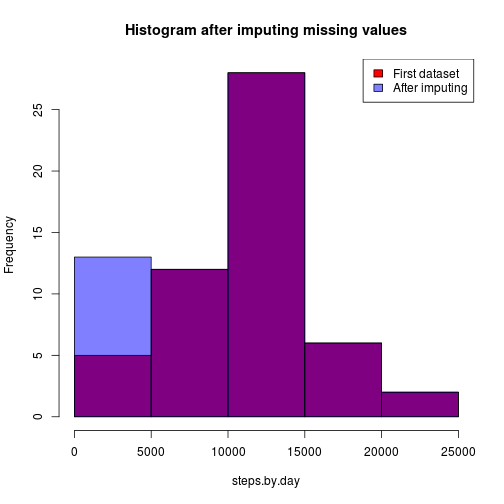
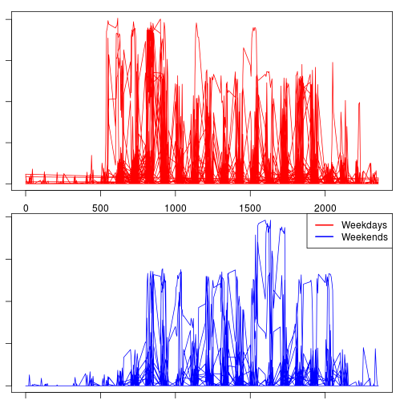

## Loading and preprocessing the data

This assignment makes use of data from a personal activity monitoring
device. This device collects data at 5 minute intervals through out the
day. The data consists of two months of data from an anonymous
individual collected during the months of October and November, 2012
and include the number of steps taken in 5 minute intervals each day.

* Dataset: [Activity monitoring data](https://d396qusza40orc.cloudfront.net/repdata%2Fdata%2Factivity.zip) [52K] 
Downloads and loads the dataset: 

```r
download.file("https://d396qusza40orc.cloudfront.net/repdata%2Fdata%2Factivity.zip","activity.zip",method="curl")
unzip("activity.zip")
data <-read.csv("activity.csv")
```

## What is mean total number of steps taken per day?

For this part, we're going ignore the missing values.

Let's calculate and report the mean and median total number of steps taken per day.

```r
steps.by.day <- by(step_data$steps,step_data$date,sum)
mean <- round(mean(steps.by.day,na.rm=TRUE),2)
median <- round(median(steps.by.day,na.rm=TRUE),2)
```

The mean is 1.076619 &times; 10<sup>4</sup> while the median is 1.0765 &times; 10<sup>4</sup>. Below we can see a histogram of the total number of steps taken each day
 

## What is the average daily activity pattern?

The number of steps taken in any interval varies througout the day. We are going to measure the average number of steps taken, averaged across all days.


```r
mean.by.interval <- data.frame("Interval"=integer(),"Average"=numeric())

for (i in (unique(step_data$interval))) {
  mean.by.interval <- rbind(mean.by.interval, data.frame(
    Interval=i,
    Average=mean(step_data[step_data$interval==i,1])
    ))
}
max.interval <- mean.by.interval[mean.by.interval$Average == max(mean.by.interval$Average),"Interval"]
max.index <- which.max(mean.by.interval[,2])
```

On average across all the days in the dataset, the 5-minute interval that has the highest number of steps is the 104^th interval, which begins at minute 835 

Below we plot the 5-minute intervals (x-axis) and the average number of steps taken, averaged across all days (y-axis)

 

## Imputing missing values

In the original data set there are a number of days/intervals where there are missing values (coded as NA). The presence of missing days may introduce bias into some calculations or summaries of the data.


The total number of missing values in the dataset is 2304

In this part we are going to evaluate the impact of imputing missing data on the estimates of the total daily number of steps.

We are therefore going to fill in all the missing values in the dataset, using the mean value for that day to substitute the missing values . 

```r
new_data <- data
for (i in (1:nrow(new_data))) {
  if (is.na(new_data[i,1])) {
    this_day_data <- subset(data,date==data[i,2])
    this_day_mean = mean(this_day_data$steps ,na.rm = TRUE)
    new_data[i,1] <- if (is.nan(this_day_mean)) 0 else this_day_mean
  }
}

new_steps.by.day <- by(new_data$steps,new_data$date,sum)
new_mean <- round(mean(new_steps.by.day,na.rm=TRUE),2)
new_median <- round(median(new_steps.by.day,na.rm=TRUE),2)


mean_diff <- new_mean - mean
median_diff <- new_median - median
```

The difference in the mean and the median between this new dataset and the initial one where we simply removed the missing value is: 

* **Mean**: -1411.96

* **Median**: -370

Let's also show a histogram to compare the new data with the previous one
 


## Are there differences in activity patterns between weekdays and weekends?
Create a new factor variable in the dataset with two levels -- "weekday"=1 and "weekend"=0 indicating whether a given date is a weekday or weekend day. Create two new data frames to compare by splitting the original one by this factor 


```r
step_weekdays <- step_data
step_weekdays$weekday <- with(step_data,as.factor(as.POSIXlt(step_data$date)$wday >= 1 & as.POSIXlt(step_data$date)$wday <= 5))
#add appropriate label to factors
levels(step_weekdays$weekday) = c("weekend","weekday")

#split in two different datasets to plot 
weekdays = step_weekdays[step_weekdays$weekday=="weekday",]
weekends = step_weekdays[step_weekdays$weekday=="weekend",]
```

Finally, let's compare the plot of the two different datasets, split by the weekday factor

 
